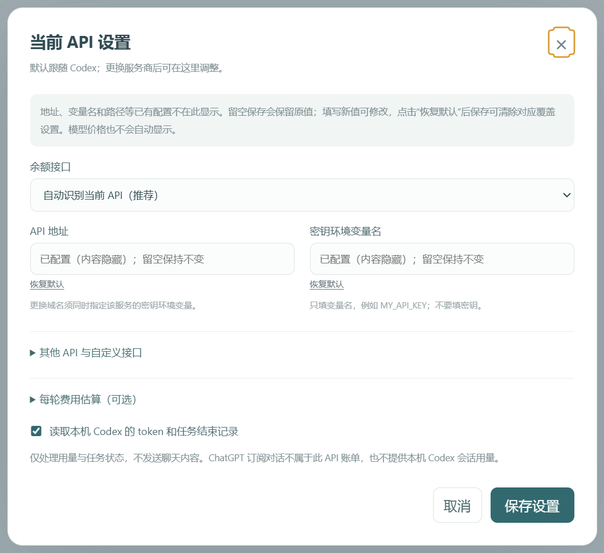
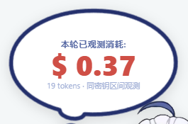
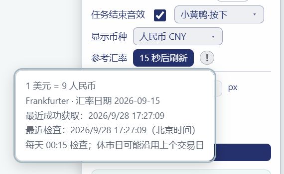

# API 余额小鲸鱼 · Codex v0.2(fixed)

跟随 Windows Codex 桌面窗口的 API 余额挂件：查看当前 API 余额、今日已观测消耗和每轮用量，保留角色、气泡、音效、拖动吸附及素材管理。

**本分支当前交付 Windows v0.2(fixed)**，内部版本为 `0.2.0`。本次由项目协作者 [Yang-huai406](https://github.com/Yang-huai406) 整理上传，仓库所属账号仍为 [MeteorNOX](https://github.com/MeteorNOX)。上传前分支已有的 0.2.4/macOS 文件保留在[后续整合资料](https://github.com/MeteorNOX/DeepSeek-Balance-Whale-Widget/tree/For-Codex/archive/for-codex-0.2.4)，完整历史没有改写。

[下载 v0.2(fixed)](https://github.com/MeteorNOX/DeepSeek-Balance-Whale-Widget/releases/download/v0.2.0-fixed/api-balance-whale-v0.2-fixed.zip) · [SHA-256](https://github.com/MeteorNOX/DeepSeek-Balance-Whale-Widget/releases/download/v0.2.0-fixed/api-balance-whale-v0.2-fixed.zip.sha256) · [Release](https://github.com/MeteorNOX/DeepSeek-Balance-Whale-Widget/releases/tag/v0.2.0-fixed) · [上传说明](docs/GITHUB_PUBLISHING.md)

## 功能

| 功能 | 当前行为 |
| --- | --- |
| 当前 API 余额 | 默认跟随本机 Codex 配置，支持兼容账单、密钥额度与同域自定义 JSON 接口 |
| 窗口跟随 | 透明工具窗口跟随 Codex；最小化时隐藏，还原或关闭模态对话框后恢复 |
| 自动启动 | 当前用户计划任务通过 GUI 启动器启动监视器，避免常驻空终端 |
| 币种显示 | USD/CNY 共用显示偏好和参考汇率；余额、预警、预算同步换算，显示两位小数 |
| 账本 | 保留日汇总、每轮观测记录和可用 token；区分已观测、估算、待记账与未知 |
| 主轮与子任务 | 成功主轮只通知一次；子任务保留用量，不重复叠加同密钥区间费用 |
| 交互与素材 | 角色与动图、拖动吸附、300 ms 翻转、按压效果、随机气泡、音效和自定义素材 |
| 内容稳定 | 观看期间保持气泡快照，后台余额刷新不重建当前气泡或重抽随机语 |
| 隐私设置 | 不回显真实服务商、地址、账号、配置方案、个人目录及密钥环境变量名 |

本版本已按适配要求移除独立网页和峰谷功能。它是桌面覆盖式挂件，不是向 Codex 主界面注入原生组件。

## 安装

需要 **Windows x64、Codex 桌面应用、含 npm 的 Node.js 24+**。安装器需要支持 `plugin add` 的 Codex CLI，会优先探测桌面应用附带的 CLI。首次安装需要联网下载 Electron 44.3.0，本包不是离线运行时整合包。

1. 解压 `api-balance-whale-v0.2-fixed.zip`。
2. 进入 `api-balance-whale` 文件夹，双击 **安装插件.cmd**。
3. 等待完成；安装器会备份旧代码和数据，注册插件及自动跟随任务，并核对启动状态。
4. 新建 Codex 聊天以加载更新的技能与工具，检查小鲸鱼自动出现。

只检查安装条件：

```powershell
powershell.exe -NoProfile -ExecutionPolicy Bypass -File .\scripts\install-package.ps1 -CheckOnly
```

默认代码目录为 `%USERPROFILE%\plugins\api-balance-whale`。默认个人市场只新增或更新本插件条目，保留其他插件。可用 `-CodexCli`、`-DataDir` 指定 CLI 和数据目录。脚本不永久修改系统执行策略；组织策略限制仍可能阻止执行。

## 使用与设置

- 点击小鲸鱼查看气泡；菜单用于调整角色、大小、币种、音效、预警、预算和素材。
- `Ctrl+Alt+W` 或托盘菜单可隐藏/显示挂件。
- 若进程仍在但画面未出现，可在托盘选择“恢复显示小鲸鱼”，无需先隐藏再显示；切回 Codex 也会触发一次受控恢复。正常心跳不会反复隐藏/显示。
- “每轮消耗提示”控制成功轮次和取消轮次的费用气泡，关闭它不会删除账本记录。
- API 设置内，已有私有字段显示“已配置（内容隐藏）”。留空保存保留原值；填写新值才修改，点击“恢复默认”后保存才清除该项覆盖。
- 模型价格只在主动编辑时更新，未编辑保存不会清空已有价格。



*截图来自隔离测试，不含真实账号或 API 凭据。*

## 取消、失败与费用口径

| 情况 | 提示行为 |
| --- | --- |
| 主轮成功结束 | 按开关显示消耗、播放成功音；去重后只触发一次 |
| 运行到一半取消 | 启用“每轮消耗提示”时报告中性消耗结算；不播放成功音 |
| 取消时金额未确认 | 显示待记账/金额未知及已记录的 token，不把未知显示成零 |
| 取消前曾遇到拥挤 | 取消优先，不说“挤不进去...” |
| 普通失败 | 不使用独立趣味提示，已观测用量仍保留在账本 |
| 指定拥挤错误造成最终失败 | 显示“挤不进去...”，避免重试期间提前或过时提示 |

指定错误为 `We're currently experiencing high demand, which may cause temporary errors.`，不是把所有网络错误、限额错误或取消都归为拥挤。取消后立刻开始新一轮，也不会丢掉上一轮应显示的消耗结算。



*金额和 token 均为合成测试示例。*

余额接口可能返回账户余额，也可能只返回 API 密钥额度；密钥不限额不等于账户余额无限。ChatGPT 订阅额度不是本插件查询的 API 余额。

“同密钥区间观测”可能包含同期其他任务、设备或子任务的消费，不是服务商逐请求最终账单；配置模型价格得到的结果标为估算。延迟出现且无法可靠归属的扣费不能全部补到上一轮。旧版本已经丢失的历史汇总不能凭空恢复。

## 汇率

- 参考汇率来自 Frankfurter；按北京时间每天 **00:15** 检查，并在启动、唤醒或恢复联网时补查。
- “刷新汇率”支持手动检查，合并在途请求并有 15 秒防连点间隔。
- 点击右侧灰色圆形 **!** 才展开汇率值、报价日期、最近获取/检查时间及缓存说明；再次点击、点击外部或按 Esc 收起。
- 周末和休市日可能沿用上个交易日的报价；00:15 是插件检查时间，不是上游保证发布新报价的时间。
- 显示换算不修改 API 原始金额或账本币种。自动更新保持当前气泡快照，手动刷新按既有规则同步金额文字。



*截图中的汇率为测试示例，不是当前市场报价。*

## 数据、停用与回滚

数据默认位于 `%USERPROFILE%\.codex\whale-widget`，支持 `CODEX_HOME`、`WHALE_HOME`。密钥由本机服务从 Codex 配置或指定环境变量读取，不需要贴到聊天或填写到插件设置。更换目标域名不能静默复用原服务密钥。

双击 **停用自动跟随.cmd** 可停止挂件并移除其启动任务，保留数据。退出挂件只停止观察，不会停止 Codex 本身的调用。

双击 **回滚本次安装.cmd** 使用本机安装回执回滚。回滚先建立当前检查点，恢复安装前代码和启动状态，保留最新账本、设置与素材。首次安装没有旧插件时，回滚移除本次注册和启动项，保留数据。

```powershell
powershell.exe -NoProfile -ExecutionPolicy Bypass -File .\scripts\rollback-package.ps1 -CheckOnly
```

安装中途失败时，使用错误信息给出的私有备份内 `recovery-scripts\rollback-package.ps1` 和 `installation.json`。备份可能含个人数据，不属于分享包。

## 验证状态与反馈

修复基线完成了 **170 项自动测试、14 项实际界面检查、100 次独立窗口最小化/还原、50 次原生另存为打开/取消**。上传前又针对显式显示、返回宿主窗口的恢复进行了加固；本次完整自动测试为 **179 项通过**，窗口验证范围见 [验证记录](docs/VALIDATION.md)。

本次已获得上传此分支的授权；没有把未提供的人工验收项目标记为通过。请按 [用户测试清单](docs/USER_TEST_CHECKLIST.md) 继续复查实际环境，尤其是偶发消失、跨屏与实际保存场景。

当前边界：Windows Codex 可识别安装布局；不宣称支持 macOS/Linux；未逐一覆盖所有多屏/DPI组合或“保存成功”的业务流程。没有可靠接口的服务不能凭空显示余额。问题反馈不要附上密钥、认证文件或完整会话日志。

## 开发与来源

技术栈：Electron 44.3.0、JavaScript、Windows 原生 C# 跟随层及 PowerShell 安装/监视器。

```powershell
node --test tests/*.test.mjs
```

[两阶段开发摘要](docs/DEVELOPMENT_SUMMARY.md) · [变更记录](CHANGELOG.md) · [Release 文案](RELEASE_NOTES.md) · [GitHub 发布材料与步骤](docs/GITHUB_PUBLISHING.md)

基于 **dsh-whale-widget 0.3.0-beta** 适配，保留原作者 **MeteorNOX** 的代码 MIT 版权及第三方声明。图片、动图、音效按上游 as-is 条款随挂件分发，不因代码 MIT 许可而获得再许可。感谢 [1llysviel](https://github.com/1llysviel) 在 [PR #128](https://github.com/MeteorNOX/DeepSeek-Balance-Whale-Widget/pull/128) 中的 macOS 工作，相关成果保留供后续整合。

[LICENSE](LICENSE) · [第三方声明](THIRD_PARTY_NOTICES.md) · [来源与署名](docs/ATTRIBUTION.md) · [上游历史 README](docs/UPSTREAM-README.md)
